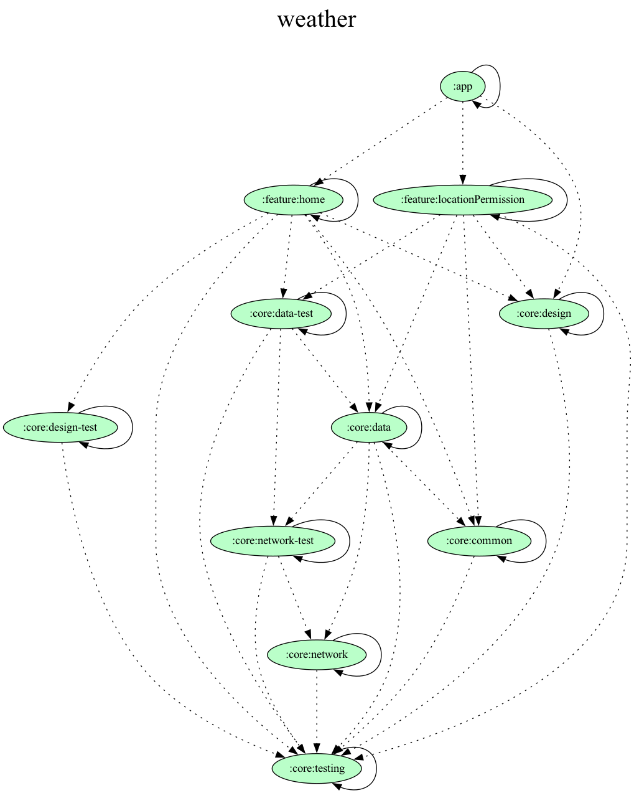

# Weather

## Architecture

[Recommended app architecture](https://developer.android.com/topic/architecture#recommended-app-arch)
[Android app modularization](https://developer.android.com/topic/modularization)

## Libraries

- [Retrofit](https://github.com/square/retrofit): most popular HTTP client library
- [Kotlin Coroutines](https://kotlinlang.org/docs/coroutines-overview.html): asynchronous and non-blocking
- [Kotlinx Serialization](https://github.com/Kotlin/kotlinx.serialization): parsing, for json
- [Jetpack Compose](https://developer.android.com/jetpack/compose): who really likes xml?
- [Jetpack Material 3](https://developer.android.com/reference/kotlin/androidx/compose/material3/package-summary): Material 3 themes and components
- [Lottie](https://airbnb.io/lottie/): Adobe After Effects animations
- [Hilt](https://developer.android.com/training/dependency-injection/hilt-android): DI, so readability, extensibility and tests made easy

## Dependency graph

